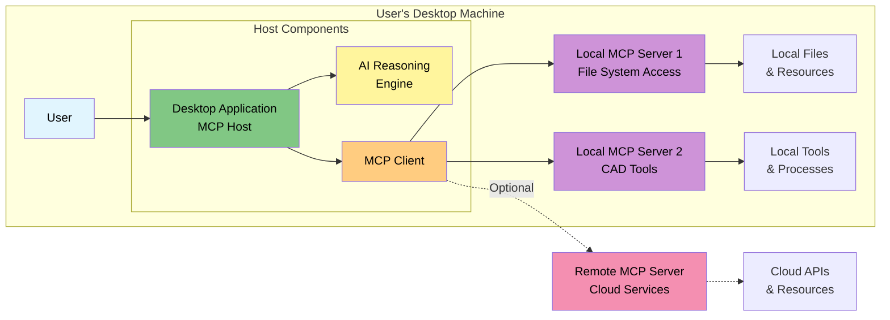
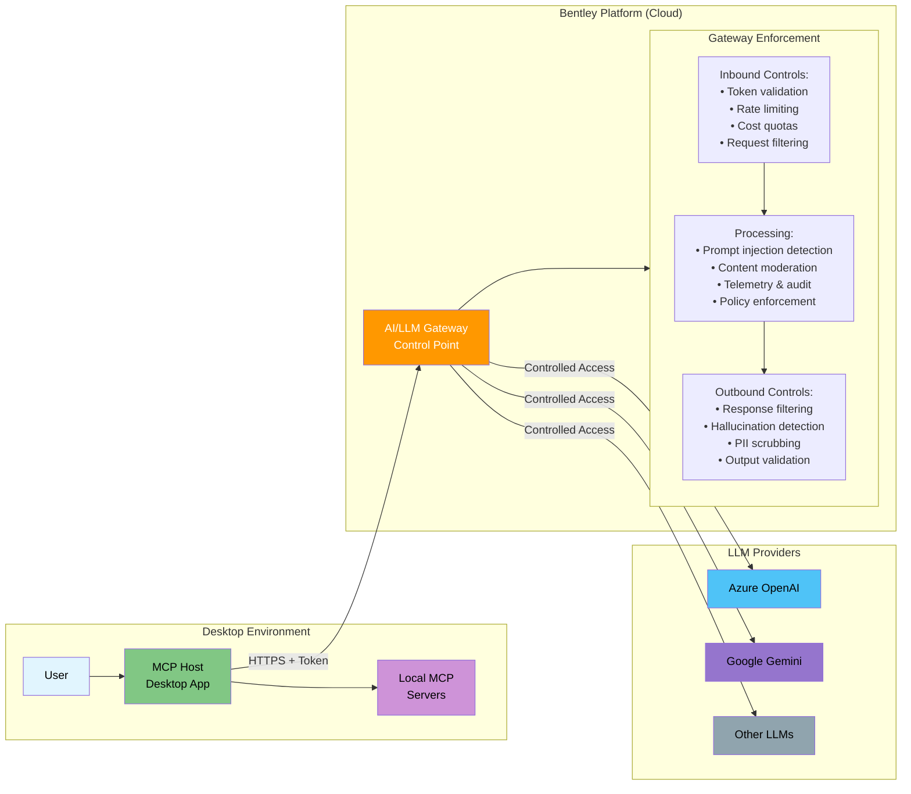
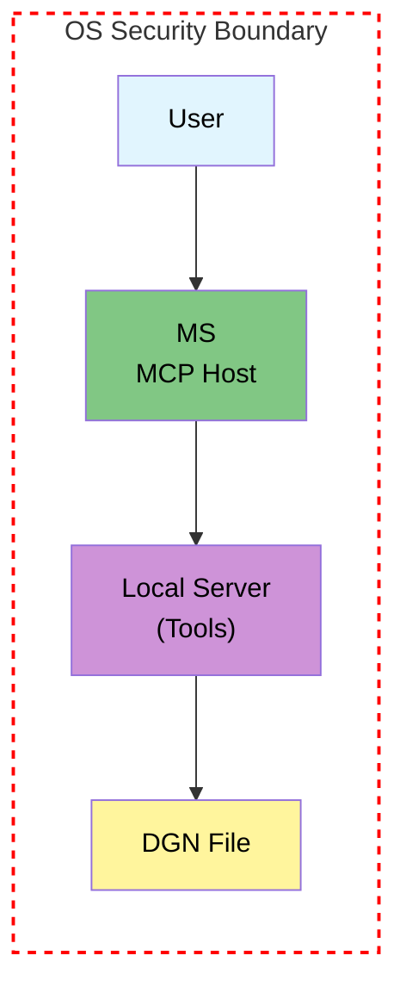
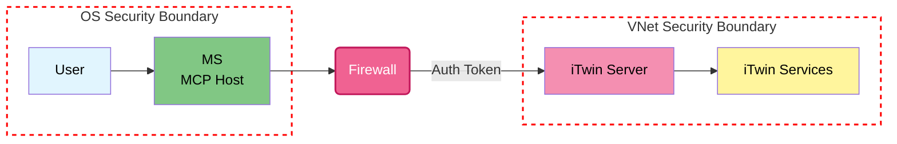
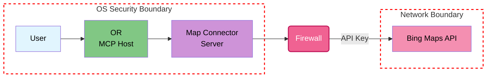

# Desktop-Local Deployment Model

> See the Architecture Layer Model for context: [[Home → Architecture Layer Model|Home#architecture-layer-model]]

## Summary
This page is a concise **implementation guide** for Desktop-Local deployments. It enumerates the controls Desktop-Local teams must implement and links to the canonical rationale and threat analysis in the **Security Architecture**.

## Scope & Security Assumptions
- This guide covers both **first-party** and **third-party** MCP client connections to local MCP servers. For third-party client specifics, see [[Third-Party Client Compatibility|Third-Party-Client-Compatibility]].
- Desktop-Local has **distinct** security considerations versus cloud and **can** be secured with **defense-in-depth** when the controls below are applied.
- Treat **LLM output as untrusted input**; parameterize and filter it before use by the host or tools.
- When third-party clients connect, **only server-side controls are enforceable** — Host-side TCM enforcement, Discovery Service gating, and behavioral baselines are not available.

## Implementation Quickstart
- **Support stdio transport** — the most universally supported transport for local MCP servers. Required for third-party client compatibility.
- Use the **AI/LLM Gateway** for all LLM traffic (metering, guardrails, telemetry). → [Control 6](https://github.com/iTwin/platform-mcp/wiki/Security-Architecture#control-6-ai-llm-gateway)
- Enforce **signed Tool Capability Manifests (TCM)** at host and server (first-party Hosts only; third-party clients ignore TCMs). → [Section 6](https://github.com/iTwin/platform-mcp/wiki/Security-Architecture#6-tool-capability-manifest-tcm)
- **Validate all inputs server-side** against strict JSON schemas — this is the only validation layer when third-party clients connect.
- **Propagate the user token end-to-end**; avoid disjointed authorization. → [Control 1](https://github.com/iTwin/platform-mcp/wiki/Security-Architecture#control-1-user-context-authorization)
- Apply **two-layer sandboxing** (host + server) for first-party Hosts; ensure **server-side sandboxing is self-sufficient** for third-party clients. → [Control 3](https://github.com/iTwin/platform-mcp/wiki/Security-Architecture#control-3-two-layer-sandboxing-strategy)
- Require **explicit consent** for state-changing actions. → [Control 4](https://github.com/iTwin/platform-mcp/wiki/Security-Architecture#control-4-explicit-consent)
- Enable **runtime monitoring & baselining** (detective controls). → [Control 5](https://github.com/iTwin/platform-mcp/wiki/Security-Architecture#control-5-runtime-monitoring)
- **Parameterize and filter** LLM inputs (direct & indirect injection). → [Control 7](https://github.com/iTwin/platform-mcp/wiki/Security-Architecture#control-7-llm-input-parameterization--filtering)
- Discover only **vetted servers** via the Discovery Service (first-party Hosts). → [Control 2](https://github.com/iTwin/platform-mcp/wiki/Security-Architecture#control-2-curated-tool-environment)

## Controls Overview

| # | Control | Prevent/Detect | Where Enforced | Covers (examples) | Read more → |
|---|---|---|---|---|---|
| 1 | **User-Context Authorization** | Prevent | Backend APIs, Servers, Host | Broken authn/z, excessive permissions | [Control 1](https://github.com/iTwin/platform-mcp/wiki/Security-Architecture#control-1-user-context-authorization) |
| 2 | **Curated Tool Environment (Discovery)** | Prevent | Discovery Service, Host | Tool poisoning/shadowing, impersonation | [Control 2](https://github.com/iTwin/platform-mcp/wiki/Security-Architecture#control-2-curated-tool-environment) |
| 3 | **Two-Layer Sandboxing** | Prevent | Host + MCP Servers | Tool misuse, planning abuse, code exec | [Control 3](https://github.com/iTwin/platform-mcp/wiki/Security-Architecture#control-3-two-layer-sandboxing-strategy) |
| 4 | **Explicit Consent (human-in-the-loop, HITL)** | Prevent/Detect | Application UI | Prompt injection → unsafe writes | [Control 4](https://github.com/iTwin/platform-mcp/wiki/Security-Architecture#control-4-explicit-consent) |
| 5 | **Runtime Monitoring & Baselining** | Detect | Gateway, Host, Servers | Anomalous chains, SSRF, abuse | [Control 5](https://github.com/iTwin/platform-mcp/wiki/Security-Architecture#control-5-runtime-monitoring) |
| 6 | **AI/LLM Gateway** | Prevent/Detect | Cloud/Platform | Cost abuse, injection filters, telemetry | [Control 6](https://github.com/iTwin/platform-mcp/wiki/Security-Architecture#control-6-ai-llm-gateway) |
| 7 | **Signed Tool Capability Manifest (TCM)** | Prevent | Host + Servers | Trust, schema, isolation, consent triggers | [Section 6](https://github.com/iTwin/platform-mcp/wiki/Security-Architecture#6-tool-capability-manifest-tcm) |
| 8 | **LLM Input Parameterization & Filtering** | Prevent/Detect | Host (+ Gateway) | Direct/indirect injection, tool poisoning | [Control 7](https://github.com/iTwin/platform-mcp/wiki/Security-Architecture#control-7-llm-input-parameterization--filtering) |
| 9 | **(Optional) MCP Server Proxying for 3P** | Prevent/Detect | Host | Untrusted/3P servers (sanitize/mediate) | [Control 8](https://github.com/iTwin/platform-mcp/wiki/Security-Architecture#control-8-mcp-server-proxying-optional) |

## Do / Don't

*   ✅ **Local: DO** support **stdio** transport to ensure compatibility with third-party MCP clients (Claude Desktop, Cursor, VS Code, etc.).
*   ✅ **DO** enforce all security controls **server-side** — third-party clients will not enforce TCM constraints.
*   ✅ **DO** provide clear, complete `tools/list` responses with accurate descriptions and strict `inputSchema` — this is the only metadata third-party clients see.
*   ✅ **DO** route all LLM traffic through a central AI Gateway (when using first-party Hosts).
*   ✅ **DO** ensure every tool has a signed manifest (TCM) declaring its capabilities and needs (for first-party Hosts).
*   ✅ **DO** propagate the user's identity token end-to-end. Let the backend API be the final arbiter of permissions.
*   ✅ **DO** implement Human-in-the-Loop consent gates for any action that changes state.
*   ✅ **DO** document how to configure your server in Claude Desktop and other third-party clients.

*   ❌ **DON'T** rely on the MCP Host to validate inputs — always validate server-side.
*   ❌ **DON'T** implement security controls without understanding the full threat model. See [Security Architecture](Security-Architecture.md) for complete analysis.
*   ❌ **DON'T** allow the MCP Host to have any permissions beyond calling tools defined in a manifest.
*   ❌ **DON'T** assume client-side audit logging is "tamper-proof." It is not feasible on a user's machine.
*   ❌ **DON'T** implement security controls that diverge from the main Security Architecture.

## Threats Reference
See **OWASP LLM Top 10 in MCP context** and **MCP-specific attack scenarios** in
[Security Architecture §4](https://github.com/iTwin/platform-mcp/wiki/Security-Architecture#4-owasp-llm-top-10-threat-analysis--mcp-attack-vectors).

## Definition
A deployment model where the MCP Host runs locally on the user's machine, typically within a desktop application, enabling direct interaction with local resources and tools.

## When to Choose Desktop-Local

Choose this when:

* You need offline mode or low-latency access to local files/devices
* Tight desktop application integration matters (e.g., CAD)
* Network connectivity is unreliable

Avoid this when:

* You need centralized policy enforcement for many users
* Most data and tools are cloud-hosted and latency is acceptable

## Architecture Diagram

#### AI/LLM Gateway Pattern
The AI Gateway is a critical control that centralizes security, cost management, and observability for all LLM interactions.

## Key Characteristics
- MCP Host runs on user's device (e.g., in Electron app, native desktop app)
- Can access local file systems and desktop resources
- MCP Servers can be local (same machine) or remote (cloud-based)
- Direct control over local tools without network round-trips
- User's auth token stays on the client for local MCP Servers and is sent to remote MCP Servers when accessing cloud resources

## Remote Calls in a Multi-Tenant World
For token delegation, on-behalf-of flows, tenant scoping, and session isolation, see
[Multi-Tenancy Architecture and Session Isolation](https://github.com/iTwin/platform-mcp/wiki/Security-Architecture#9-multi-tenancy-architecture-and-session-isolation).

## Official MCP Terminology
- **Host**: The local application acting as "container and coordinator"
- **Client**: Component within the Host managing server connections
- **Server**: Can be local processes or remote endpoints

## Patterns & Examples

1. **MicroStation desktop**
   - CAD application with local tool servers for geometry manipulation
   - Direct access to local design files
   - Integration with local rendering engines

2. **Desktop app calling cloud APIs**
   - Local Host orchestrating remote MCP servers
   - Bentley desktop products accessing iTwin services
   - Local computation with cloud service integration

3. **Seequent LeapFrog with embedded MCP server**
   - Geological modeling desktop application with embedded MCP server
   - Exposes UI automation capabilities as callable tools
   - Desktop app listens on local port for agent commands
   - Enables automation of complex multi-step workflows

4. **Third-party client connecting to a Bentley local MCP server**
   - Claude Desktop or Cursor spawning a local Bentley MCP server via stdio
   - User configures the server in the client's config file
   - No authentication steps required since the client spawns the server directly
   - All security controls enforced server-side
   - See [[Third-Party Client Compatibility|Third-Party-Client-Compatibility]] for configuration examples

<strong>Real-world deployment patterns and security models</strong>

| Host Location | Server Location | Resource Location | Description | Example |
|:-------------|:---------------|:-----------------|:------------|:--------|
| **Local** | **Local** | **Local** | **Fully Self-Contained** | MicroStation using a local tool to edit a local DGN file |
| **Local** | **Remote** | **Remote** | **Direct Cloud Call** | MicroStation calling a remote iTwin service (as an MCP Server) in the cloud |
| **Local** | **Local** | **Remote** | **Local Connector / Abstraction Layer** | OpenRoads calling a local `MappingConnector` server that in turn calls the Bing Maps web API |

### Scenario Diagrams

#### Scenario 1: Fully Self-Contained

**How it works:** In this scenario, all components—the user, the MCP Host (e.g., MicroStation), the MCP Server providing tools, and the target resource (a local file)—reside on the same local machine. The Host communicates directly with the local server to perform operations without any network latency, making it ideal for high-performance, offline tasks.

#### Scenario 2: Direct Cloud Call

**How it works:** The MCP Host runs locally on the user's machine, but it communicates over the network with a remote MCP Server hosted in the cloud. The local Host sends a request, including the user's authentication token, to the remote server, which then accesses cloud resources (e.g., iTwin services) on the user's behalf. This pattern allows desktop applications to leverage powerful cloud-based tools.

#### Scenario 3: Local Connector Pattern

**How it works:** This pattern uses a local MCP Server as an abstraction layer or "connector" to a non-MCP external service (like a public web API). The local MCP Host communicates with the local connector server, which handles the logic of calling the external API, including managing API keys and translating requests. This encapsulates external integrations and keeps sensitive credentials off the main Host application.

*If the connector calls Bentley APIs, use OAuth 2.0 Token Exchange (RFC 8693) to obtain a delegated token (aud=API) rather than forwarding any primary token.*

