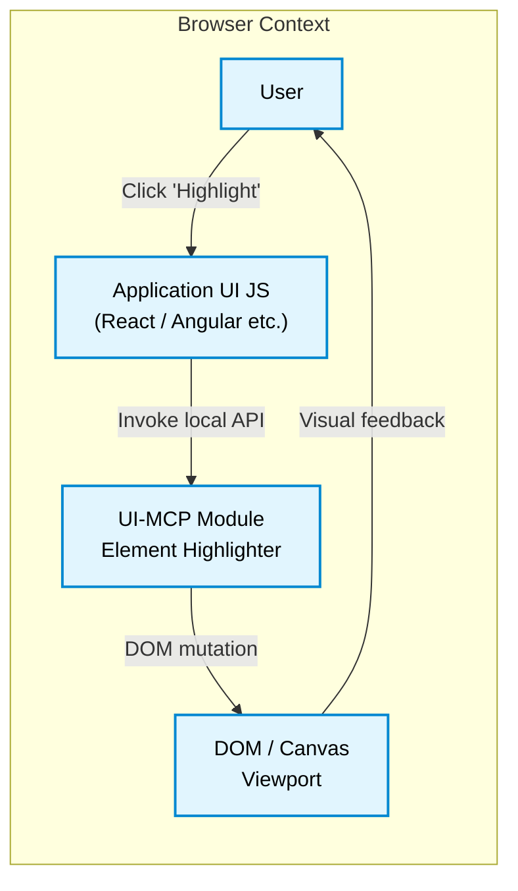
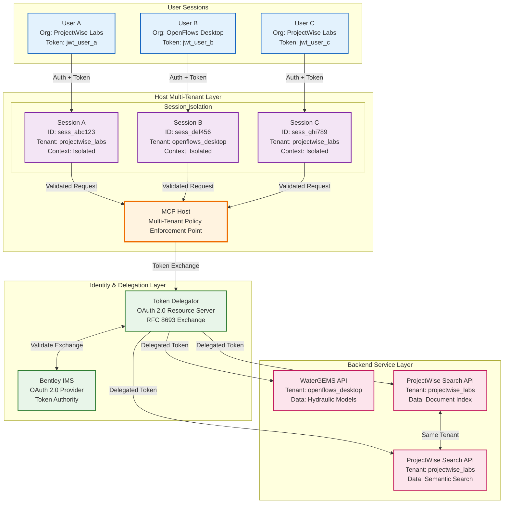
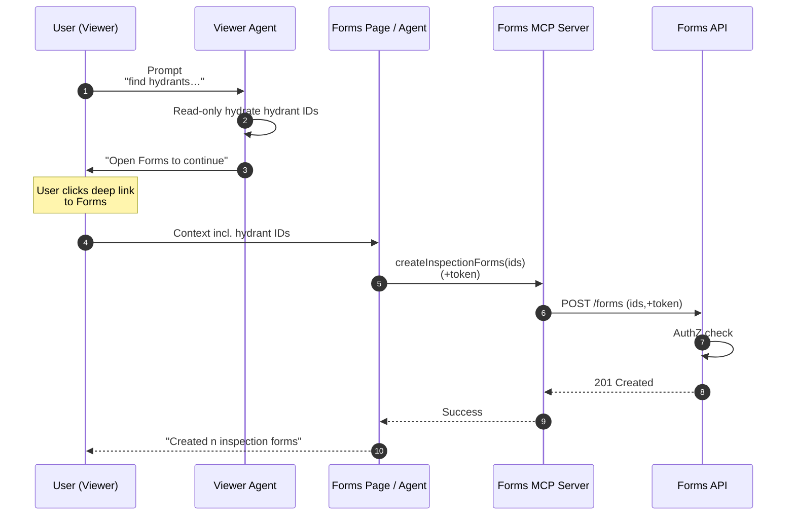

# Security Architecture

## Table of Contents

- [1. Introduction](#1-introduction)
- [2. Definitions](#2-definitions)
- [3. Core Threat Model: The Confused Deputy Problem](#3-core-threat-model-the-confused-deputy-problem)
- [4. OWASP LLM Top 10 Threat Analysis & MCP Attack Vectors](#4-owasp-llm-top-10-threat-analysis--mcp-attack-vectors)
- [5. Core Security Controls](#5-core-security-controls) - [6. Tool Capability Manifest (TCM)](#6-tool-capability-manifest-tcm)
- [7. Architectural Security Flow & Diagram](#7-architectural-security-flow--diagram)
- [8. OWASP LLM Threat-Control Traceability Matrix](#8-owasp-llm-threat-control-traceability-matrix)
- [9. Multi-Tenancy Architecture and Session Isolation](#9-multi-tenancy-architecture-and-session-isolation)
- [10. Isolation Requirements for "Code Mode"](#10-isolation-requirements-for-code-mode)
- [Appendix A: Out-of-Scope Threat Scenarios](#appendix-a-out-of-scope-threat-scenarios)
- [Appendix B: Pattern – Cross-Service "Find & Create" Workflow](#appendix-b-pattern--cross-service-find--create-workflow)

<a id="1-introduction"></a>
## 1. Introduction

This document is a living specification. The security architecture and requirements will evolve alongside industry best practices and the MCP specification. The page is not reader-versioned and may be updated over time.

This document defines the security architecture and requirements for the Model Context Protocol (MCP) guidelines.

The core security principle is that an **MCP Host must operate strictly within the security context of the authenticated user.** The MCP Host is a proxy for the user; it never possesses its own identity or permissions.

<a id="2-definitions"></a>
## 2. Definitions

*   **Authentication (AuthN):** Verifying a user's identity. In this context, this is handled exclusively by Bentley IMS.
*   **Authorization (AuthZ):** Determining the actions an authenticated user is permitted to perform on a resource.

<a id="3-core-threat-model-the-confused-deputy-problem"></a>
## 3. Core Threat Model: The Confused Deputy Problem

The fundamental security challenge in MCP is a classic computer science vulnerability known as the "Confused Deputy Problem."

1.  An **MCP Host** is the "deputy" with the power to execute actions (call tools).
2.  The **User** provides instructions to the deputy.
3.  A **malicious instruction** (e.g., a prompt injection) can trick the deputy into misusing its authority.

The MCP Host itself does not understand user intent. Therefore, our entire security model is designed to contain the deputy. The MCP Host's authority is strictly and dynamically limited to the authority of the authenticated user for any given operation.

<a id="4-owasp-llm-top-10-threat-analysis--mcp-attack-vectors"></a>
## 4. OWASP LLM Top 10 Threat Analysis & MCP Attack Vectors

### 4.1 Primary OWASP LLM Threats in MCP Context

Our security model specifically addresses two critical OWASP LLM Top 10 threats that are most relevant to MCP architectures, presented in the order a reader will typically encounter them: **LLM01 (Prompt Injection)** → **LLM02 (Insecure Output Handling/SSRF)**. For background, see [OWASP Agentic AI – Threats and Mitigations](https://genai.owasp.org/resource/agentic-ai-threats-and-mitigations/).

#### **OWASP LLM01: Prompt Injection (Direct & Indirect)**
**Definition:** Manipulating model behavior through crafted inputs or hostile context to bypass intended restrictions.
**MCP context:**
  - *Direct:* user input steers the Host into unsafe tool calls. - *Indirect:* hostile content in data/resources/tool descriptions alters planning.

**Primary controls:** [Control 3: Two-Layer Sandboxing](#control-3-two-layer-sandboxing-strategy), [Control 4: Explicit Consent](#control-4-explicit-consent-for-state-changing-actions), [Control 5: Runtime Monitoring](#control-5-runtime-monitoring-and-behavioral-enforcement), Control 6: AI/LLM Gateway, Control 7: LLM Input Parameterization & Filtering

#### **OWASP LLM02: Insecure Output Handling (Server-Side Request Forgery)**
**Definition:** Accepting LLM output (e.g., tool parameters) without validation, enabling SSRF or unsafe downstream effects.
**MCP context:** Host executes tool calls based on unvalidated model output.

**Primary controls:** [Control 1: User-Context Authorization](#control-1-user-context-authorization-backend-api-enforcement), [Control 3: Two-Layer Sandboxing](#control-3-two-layer-sandboxing-strategy), [Control 5: Runtime Monitoring](#control-5-runtime-monitoring-and-behavioral-enforcement), Control 6: AI/LLM Gateway, Control 7: LLM Input Parameterization & Filtering

### 4.2 MCP-Specific Attack Scenarios

Building on the OWASP foundation, we identify specific threat vectors in MCP Host systems:

#### **4.2.1 MCP Server Hijacking (Infrastructure Layer)**
> **Mitigation links:** jump to the Controls section below.

1. **Tool Poisoning:** Hiding malicious instructions in tool descriptions or data.
   *Mitigations:* [Control 2: Curated Tool Environment](#control-2-curated-tool-environment), [Control 3: Two-Layer Sandboxing](#control-3-two-layer-sandboxing-strategy)
2. **Tool Shadowing:** Overriding legitimate tools with malicious lookalikes.
   *Mitigations:* [Control 2: Curated Tool Environment](#control-2-curated-tool-environment), [Control 3: Two-Layer Sandboxing](#control-3-two-layer-sandboxing-strategy)
3. **Tool Definition Mutation ("Rug Pull"):** Tool behavior changes post-approval.
   *Mitigations:* [Control 2: Curated Tool Environment](#control-2-curated-tool-environment), [Control 3: Two-Layer Sandboxing](#control-3-two-layer-sandboxing-strategy)
4. **Malicious Code Execution:** Arbitrary code execution through a tool.
   *Mitigations:* [Control 3: Two-Layer Sandboxing](#control-3-two-layer-sandboxing-strategy), [Control 5: Runtime Monitoring](#control-5-runtime-monitoring-and-behavioral-enforcement)
5. **Token Theft:** Abusing insecure token handling to impersonate user/host.
   *Mitigations:* [Control 1: User-Context Authorization](#control-1-user-context-authorization-backend-api-enforcement), [Control 5: Runtime Monitoring](#control-5-runtime-monitoring-and-behavioral-enforcement)

#### **4.2.2 MCP Host Hijacking (Agent Layer)**
> **Mitigation links:** jump to the Controls section below.

6. **Prompt Injection (Direct):** Manipulating LLM behavior through malicious user inputs.
   *Mitigations:* [Control 3: Two-Layer Sandboxing](#control-3-two-layer-sandboxing-strategy), [Control 4: Explicit Consent](#control-4-explicit-consent-for-state-changing-actions)
7. **Indirect Prompt Injection:** Injecting instructions through external data sources the MCP Host consumes.
   *Mitigations:* [Control 1: User-Context Authorization](#control-1-user-context-authorization-backend-api-enforcement), [Control 2: Curated Tool Environment](#control-2-curated-tool-environment), [Control 3: Two-Layer Sandboxing](#control-3-two-layer-sandboxing-strategy), [Control 4: Explicit Consent](#control-4-explicit-consent-for-state-changing-actions)
8. **Excessive Permissions:** Exploiting an MCP Host that has overly permissive tool access.
   *Mitigations:* [Control 1: User-Context Authorization](#control-1-user-context-authorization-backend-api-enforcement), [Control 3: Two-Layer Sandboxing](#control-3-two-layer-sandboxing-strategy)
9. **Unauthorized System Access:** Gaining system access through a compromised MCP Host or tool.
   *Mitigations:* [Control 1: User-Context Authorization](#control-1-user-context-authorization-backend-api-enforcement), [Control 5: Runtime Monitoring](#control-5-runtime-monitoring-and-behavioral-enforcement)

<a id="5-core-security-controls"></a>
## 5. Core Security Controls

The security architecture is built on core controls that work together across multiple enforcement layers.

Foundational framing for how these controls are enforced: - **Distributed enforcement across four layers:** Discovery (trust/registry), Backend APIs (contextual authorization), MCP Host (capability boundaries), Runtime Monitor (behavioral compliance).  
  For full layer definitions, see [[Implementation Guidelines → Architecture Layers and Positioning|Implementation-Guidelines#architecture-layers-and-positioning]] and [[Home → Architecture Layer Model|Home#architecture-layer-model]].
- **Discovery Service scope:** Trust-layer registry only; not a business-rules engine and cannot perform contextual authZ or parameter semantics
- **Backend APIs are ultimate authority:** Only backends have domain context to authorize specific operations by the specific user at runtime

### Control 1: User-Context Authorization (Backend API Enforcement)
<a id="control-1-user-context-authorization"></a>

This is the cornerstone of the architecture. The MCP Host's capabilities are strictly and dynamically bound to the permissions of the authenticated user.

*   **No Independent MCP Host Identity:** The MCP Host has no permissions of its own. It operates exclusively on behalf of a user.
*   **User Token Propagation:** The MCP Framework is architected to propagate the user's Bentley IMS (OAuth) access token from the client to the MCP Host and through to every subsequent tool invocation.
*   **Backend Enforcement (PRIMARY):** MCP Servers must pass the user token to their underlying backend APIs (e.g., iTwin Search API). **The backend API is the final and absolute authority** for validating the token and enforcing permissions.

**Primary Enforcement Point:** Backend APIs are the **only** services that can enforce contextual business logic, understand user permissions granularity, and make definitive authorization decisions. Neither Discovery Service nor MCP Host can make these determinations.

**Result:** This single control mitigates the most severe risks. The MCP Host can only perform an action if the backend API confirms the logged-in user has explicit permission for that action on that resource.

### Control 2: Curated Tool Environment
<a id="control-2-curated-tool-environment"></a>

To prevent the use of malicious or untrusted tools, the MCP Host operates within a strictly controlled ecosystem.

*   **MCP Server as a Stateless Proxy:** An MCP Server is architecturally defined as a stateless, passive component that exposes a backend API's functionality. It contains no independent logic and acts only as a secure wrapper.
*   **Centralized Discovery Service:** The MCP Host does not connect to arbitrary endpoints. It exclusively uses a centralized **Discovery Service** that maintains a registry of vetted, approved MCP Servers.
*   **Third-Party Server Policy:** Third-party MCP servers are **not supported**. The Discovery Service will only register servers that have passed an internal Bentley security review. This control prevents Tool Poisoning, Shadowing, and Mutation by ensuring that only trusted code is ever made available to the MCP Host.

<details open>
<summary><strong>How the Discovery Service enforces tool trust and prevents unauthorized access</strong></summary>

**What Discovery Service CAN enforce:**
*   **Server Identity & Trust:** Validates that only reviewed, signed MCP Servers are registered
*   **Manifest Structural Validation:** Ensures manifests conform to required schema and contain all mandatory fields
*   **Static Endpoint Declaration:** Verifies that declared endpoints match expected patterns and audiences
*   **Trust Chain Verification:** Validates JOSE signatures and certificate chains for manifest authenticity
*   **Basic Capability Categories:** Confirms tools are properly categorized (Read-Only, Data Modification, etc.)

**What Discovery Service CANNOT enforce:**
*   **Endpoint Semantic Context:** DS lacks understanding of what backend APIs actually do or their business logic constraints
*   **Dynamic Authorization Logic:** Cannot understand when specific endpoints should or shouldn't be called based on runtime context
*   **Cross-Service Business Rules:** Has no knowledge of complex workflows that span multiple backend services
*   **User Permission Granularity:** Cannot interpret fine-grained user permissions within backend systems
*   **API Parameter Validation:** Cannot validate that API parameters make sense within specific business contexts

**Architectural Limitation:** Discovery Service operates at the **infrastructure trust layer** (validating that servers are trusted) but cannot operate at the **business logic layer** (understanding what those servers should actually do). This is by design - DS is a lightweight registry service, not a business rule engine.

</details>

### Control 3: Two-Layer Sandboxing Strategy
<a id="control-3-two-layer-sandboxing-strategy"></a>

Our security architecture implements a two-layer sandboxing approach that addresses both MCP Server hijacking and MCP Host hijacking scenarios. This control is **enabled by the Tool Capability Manifest** (see Section 6) which defines operational boundaries and isolation requirements.

**Layer 1: MCP Server Sandboxing (Infrastructure Protection)** Each MCP Server operates within constraints declared in its TCM, preventing server-level compromise from escalating beyond declared boundaries:
- **Process/Container Isolation:** Defined by `sandboxingRequirements.isolationLevel`
- **Network Restrictions:** Enforced via `sandboxingRequirements.networkPolicy` - **File System Boundaries:** Controlled by `sandboxingRequirements.fileSystemAccess`

**Layer 2: MCP Host Sandboxing (Agent Capability Limitation)** The MCP Host operates within a "superset of valid tool capabilities" defined by the curated Discovery Service registry:
- **Tool Universe Constraint:** Can only invoke tools with valid TCMs in Discovery Service
- **Capability Boundaries:** Limited to operations within tool's declared `capability.category`
- **Parameter Validation:** Enforced against enhanced `inputSchema` constraints in TCM

<details open>
<summary><strong>Technical implementation of user-context authorization and token delegation</strong></summary>

**Layer 1 Enforcement (Infrastructure):**
- **Isolation Boundaries:** MCP Server Deployer enforces `isolationLevel` (process/container/VM)
- **Network Policies:** Restricts connections to `allowedHosts`, blocks `blockedPorts`
- **Resource Limits:** Enforces CPU/memory constraints from `maxResourceUsage` - **System Call Filtering:** Applies `allowedSystemCalls` via seccomp profiles

**Layer 2 Enforcement (Application):**
- **Tool Universe Validation:** Host verifies tool exists in Discovery Service registry
- **Capability Boundary Checks:** Validates operations against declared `category` - **Parameter Constraint Validation:** Enforces enhanced `inputSchema` rules
- **Cross-Tool Isolation:** No tool can expand Host's capability superset

**Client-Side UI Actions:**
- Executed as signed JavaScript modules with CSP sandbox directives - Network isolation via `sandboxingDirectives.csp.connectSrc` restrictions
- Browser security boundaries limit compromise to user's tab

</details>

For detailed TCM schema and enforcement specifications, see: **[Tool Capability Manifest Specification](Tool-Capability-Manifest-Specification.md)**

### Control 4: Explicit Consent for State-Changing Actions
<a id="control-4-explicit-consent"></a>

This control **requires Tool Capability Manifests** (Section 6) to function. Applications integrating the MCP Host must implement an approval gate for operations that modify state or have external side effects, as determined by the TCM's `requiresUserApproval` field.

The Tool Capability Manifest's `requiresUserApproval` field drives explicit user consent for state-changing operations. Tools marked with `requiresUserApproval: true` trigger consent dialogs that show specific action details, affected data, and consequences. 

For details on which categories require consent and the complete consent flow, see: **[Tool Capability Manifest Specification - Tool Capability Matrix](Tool-Capability-Manifest-Specification.md#tool-capability-matrix)**

**Prompt Injection Defense:**
Even if malicious content tricks the LLM into planning dangerous actions, the TCM-driven consent gate prevents execution without explicit user approval. The consent dialog surfaces the exact operation, and backend authorization provides final validation.

### Figure 1: Example Consent Dialog for MCP Host Action


*This dialog demonstrates the required user consent flow for state-changing operations. The user must explicitly approve actions before the MCP Host can proceed, providing a critical security checkpoint against prompt injection attacks.*

### Control 5: Runtime Monitoring and Behavioral Enforcement
<a id="control-5-runtime-monitoring"></a>

This control **leverages Tool Capability Manifests** (Section 6) to establish behavioral baselines and enforce runtime security policies. The TCM's `behavioralBaseline` section provides the foundation for anomaly detection and compliance monitoring.

<details open>
<summary><strong>How Tool Capability Manifests create enforceable security boundaries</strong></summary>

**Execution Baseline Validation:**
- Monitor actual execution times against TCM's `maxExecutionTimeMs` - Validate network connections match `expectedNetworkCalls` patterns
- Enforce CPU/memory usage within `maxResourceUsage` thresholds - Flag deviations as potential compromise indicators

**Isolation Boundary Monitoring:**
- Verify servers operate within declared `sandboxingRequirements` - Monitor compliance with `allowedHosts` and `blockedPorts` policies
- Validate file system access stays within `fileSystemAccess` boundaries

</details>

<details open>
<summary><strong>Comprehensive threat detection across multiple system layers</strong></summary>

**OWASP LLM Threat Monitoring:**
- **T2 (SSRF) Protection**: Detect unexpected network destinations beyond TCM declarations
- **T6 (Prompt Injection) Detection**: Analyze tool invocation patterns for injection indicators
- **Cross-Layer Correlation**: Link events across Host (Layer 2) and Server (Layer 1) sandboxes

**Rate Limiting and Abuse Prevention:**
- Per-user API limits based on TCM capability categories - Per-tool burst limits derived from `maxRequestsPerMinute` in TCM
- Mass operation detection for bulk create/delete attempts

</details>

<details open>
<summary><strong>Audit logging and forensic capabilities for security investigations</strong></summary>

**Immutable Audit Trail:**
- Log all MCP Host actions with TCM compliance status
- Record user consent decisions for `requiresUserApproval: true` operations - Track manifest signature validation results
- Maintain forensic data for post-incident analysis

</details>

For detailed behavioral baseline specifications and monitoring thresholds, see: **[Tool Capability Manifest Specification - Behavioral Baseline](Tool-Capability-Manifest-Specification.md#json-schema)**

> **Scope note:** Authoritative audit trails are maintained in gateway/platform and backend services. Client-side/desktop logs are **not** tamper-proof and should not be relied on as a source of truth.

### Optional: "Front-End Write-Only" Deployment Mode

Some teams may choose an even stricter posture in which **all** state-changing operations
("Output-Sink" and "Data Modification" categories) are executed by an MCP-client module that
lives **exclusively in the browser** and calls the underlying REST APIs directly with the user's
token. No remote MCP server is permitted to issue writes.

**Benefits:**
* Shorter audit surface – write calls originate only from the user's origin. * Even if an attacker compromises a separate service, they cannot piggy-back that compromise into cross-domain writes.

**Limitations:**
* Cross-service workflows such as "find fire hydrants in the Viewer → create forms in the Forms service" require the user to transition to the Forms UI (or deep-link) before the write can occur.
* Offline batch MCP Hosts are not possible in this mode.

Teams MUST document in their service README which posture they adopt.

<details open>
<summary><strong>How runtime monitoring enforces sandboxing and detects violations</strong></summary>

Behavioral monitoring serves as the critical runtime enforcement mechanism for our two-layer sandboxing strategy. It acts as a dynamic security boundary that validates both layers operate within expected parameters:

**Layer 1 Runtime Enforcement (MCP Server Monitoring):** - **Execution Baseline Validation:** Monitors server processes against `behavioralBaseline` metrics to detect compromise
- **Resource Constraint Enforcement:** Validates CPU, memory, and network usage against `sandboxingRequirements` 
- **Network Policy Enforcement:** Ensures servers only connect to `allowedHosts` and respect `blockedPorts`
- **System Call Monitoring:** Uses seccomp profiles to restrict server operations to `allowedSystemCalls`

**Layer 2 Runtime Enforcement (MCP Host Monitoring):**
- **Tool Invocation Validation:** Confirms Host only calls tools within the approved superset from Discovery Service
- **Parameter Constraint Checking:** Validates tool parameters against manifest `inputSchema` constraints
- **Capability Boundary Enforcement:** Prevents Host from attempting operations outside declared `capability.category`
- **Cross-Tool Correlation Analysis:** Detects potential prompt injection by analyzing tool call sequences

**Unified Threat Detection:**
The monitoring system correlates events across both layers to identify sophisticated attacks that might individually appear benign but collectively indicate compromise. This approach provides defense-in-depth against both OWASP T2 (SSRF) and T6 (Prompt Injection) threats by ensuring runtime behavior matches design-time security assumptions.

</details>

### Control 6: AI/LLM Gateway (Central Guardrail & Metering Layer)
<a id="control-6-ai-llm-gateway"></a>

A central gateway for all LLM traffic provides a single place to enforce guardrails, meter usage, and observe behavior—without duplicating logic across desktop products.

**Purpose**
- **Prevent:** cost/resource exhaustion (quotas, rate limits), unsafe generations via request/response policy checks
- **Detect:** anomalous chains and injection patterns (prompt ↔ tool-call correlation), export telemetry for cross-layer monitoring
- **Enable:** rapid incident response by updating policies centrally

**Placement**
- Cloud/Platform shared service. Desktop Hosts send LLM calls through the gateway; the gateway fans out to providers.

**Related Threats**
- Resource exhaustion, prompt injection (direct/indirect), cascading hallucination impact on plans, planning abuse.

### Control 7: LLM Input Parameterization & Filtering
<a id="control-7-llm-input-parameterization--filtering"></a>

Treat **LLM inputs and context as untrusted**. Separate instructions from data and layer runtime detectors.

**Parameterization (Prevent)**
- Structure prompts so untrusted **data** is bound into explicit **data slots** separate from instructions.
- Apply primarily at the **Host** (pre-LLM); optionally reinforce at the **Gateway**.

**Filtering/Detection (Detect)**
- Static/pattern and/or LLM-based checks for **direct and indirect prompt injection**.
- Use signals from **Runtime Monitoring** (Control 5) to flag anomalous tool-call sequences following prompt/context changes.

**Related Threats**
- Direct & indirect prompt injection, tool poisoning via descriptions, cascading hallucination.

### Control 8: MCP Server Proxying (Optional)
<a id="control-8-mcp-server-proxying-optional"></a>

When interacting with **untrusted/third-party MCP servers**, interpose a **local proxy** that:
- Sanitizes tool descriptions (neutralize instruction-like content), - Enforces stricter parameter schemas and allowlists,
- Applies per-tool rate limits.

**Note:** Not required for first-party curated environments (Control 2), but useful if/when 3P scenarios are explored.

<a id="6-tool-capability-manifest-tcm"></a>
## 6. Tool Capability Manifest (TCM)

The Tool Capability Manifest is the foundational security specification that enables **[Controls 3](#control-3-two-layer-sandboxing-strategy), [4](#control-4-explicit-consent), and [5](#control-5-runtime-monitoring)**. It extends the standard MCP tool schema with security-specific metadata required for sandboxing, user consent, and runtime monitoring.

#### Purpose and Role

The TCM serves three critical security functions:

**Supports [Control 3](#control-3-two-layer-sandboxing-strategy) (Two-Layer Sandboxing):**
- Defines tool capability categories and operational boundaries - Specifies sandboxing directives for browser and server execution
- Establishes isolation requirements and network policies

**Supports [Control 4](#control-4-explicit-consent) (Explicit Consent):** - Declares whether tools require user approval via `requiresUserApproval` field
- Categorizes tools by risk and side-effect scope
- Enables informed consent dialogs with specific action details

**Supports [Control 5](#control-5-runtime-monitoring) (Runtime Monitoring):** - Establishes behavioral baselines for anomaly detection
- Defines expected execution patterns and resource usage - Provides trust verification through JOSE digital signatures

#### Key Components

**Standard MCP Integration:**
- Embeds the complete MCP tool definition in the `spec` field - Enhances parameter constraints with security validation
- Maintains full compatibility with MCP protocol

**Security Enforcement Fields:**
- `capability`: Categorizes tool risk and determines approval requirements - `sandboxingDirectives`: Browser CSP and network policy constraints
- `sandboxingRequirements`: Infrastructure isolation specifications - `behavioralBaseline`: Expected execution patterns for monitoring
- `signature`: JOSE digital signature for authenticity and integrity

For complete technical specifications including capability categories, schema details, and implementation examples, see: **[Tool Capability Manifest Specification](Tool-Capability-Manifest-Specification.md)**

<a id="7-architectural-security-flow--diagram"></a>
## 7. Architectural Security Flow & Diagram

### Figure 2: Two-Layer Sandboxing Security Architecture

```mermaid
graph LR
    subgraph UserLayer["User Interaction Layer"]
        User["User"] 
        IMS["Bentley IMS"]
        AppUI["Application UI<br/>Consent Gateway"]
    end

    subgraph Layer2["Layer 2: MCP Host Sandbox"]
        subgraph AgentLayer["MCP Host Layer (VNet)"]
            Agent["Bentley Copilot<br/>MCP Host<br/><i>Constrained to Approved Tool Superset</i>"]
            Discovery["Discovery Service<br/>Curated Registry<br/><i>Finite Tool Universe</i>"]
        end
    end
    
    subgraph Layer1["Layer 1: MCP Server Sandbox"]
        subgraph MCPLayer["MCP Server Layer (VNet)"]
            SearchServer["iTwin Search<br/>MCP Server<br/><i>Manifest-Constrained</i>"]
            FormsServer["Forms<br/>MCP Server<br/><i>Process Isolated</i>"]
        end
    end
    
    subgraph BackendLayer["Backend API Layer (VNet)"]
        SearchAPI["iTwin Search API"]
        FormsAPI["Forms API"]
        Monitor["Runtime Monitor<br/>Behavioral Enforcement<br/><i>Cross-Layer Correlation</i>"]
        RBAC["RBAC Engine<br/>(Permissions Service)"]
    end

    %% Authentication Flow
    User -->|"Authenticate"| IMS
    IMS -->|"OAuth Token"| AppUI
    AppUI -->|"User Prompt + Token"| Agent
    
    %% Tool Discovery (Layer 2 Constraint)
    Agent -->|"Discover Tools<br/>(Finite Superset)"| Discovery
    
    %% Primary Tool Chain with Two-Layer Protection
    Agent -->|"Tool Call + Token<br/>(Layer 2: Superset Check)"| AppUI
    AppUI -->|"Consent Check"| User
    User -->|"Approve/Reject"| AppUI
    AppUI -->|"Approved Call + Token"| SearchServer
    SearchServer -->|"API Call + Token<br/>(Layer 1: Manifest Check)"| SearchAPI
    SearchAPI -->|"Validate Token"| IMS
    SearchAPI -->|"Check Permissions"| RBAC
    SearchAPI -->|"Log & Monitor<br/>(Behavioral Baseline)"| Monitor
    SearchAPI -->|"Return Data"| SearchServer
    SearchServer -->|"Return Result"| Agent
    
    %% Secondary Tool Chain
    Agent -->|"Chain Tool + Token<br/>(Layer 2: Superset Check)"| AppUI
    AppUI -->|"Approved Call + Token"| FormsServer
    FormsServer -->|"API Call + Token<br/>(Layer 1: Manifest Check)"| FormsAPI
    FormsAPI -->|"Validate Token"| IMS
    FormsAPI -->|"Check Permissions"| RBAC
    FormsAPI -->|"Log & Monitor<br/>(Cross-Layer Correlation)"| Monitor
    FormsServer -->|"Return Result"| Agent
    
    %% Runtime Monitoring Feedback
    Monitor -.->|"Anomaly Alerts<br/>(OWASP T2/T6 Detection)"| Agent
    Monitor -.->|"Policy Enforcement"| SearchServer
    Monitor -.->|"Policy Enforcement"| FormsServer
    
    %% Final Response
    Agent -->|"Final Summary"| AppUI

    %% Styling
    classDef userStyle fill:#e1f5fe,stroke:#01579b,stroke-width:2px,color:#000
    classDef layer2Style fill:#fff8e1,stroke:#f57c00,stroke-width:3px,color:#000
    classDef agentStyle fill:#fff3e0,stroke:#e65100,stroke-width:2px,color:#000
    classDef layer1Style fill:#f1f8e9,stroke:#689f38,stroke-width:3px,color:#000
    classDef mcpStyle fill:#f3e5f5,stroke:#4a148c,stroke-width:2px,color:#000
    classDef backendStyle fill:#e8f5e9,stroke:#1b5e20,stroke-width:2px,color:#000
    classDef securityStyle fill:#ffebee,stroke:#c62828,stroke-width:3px,color:#000
    
    class User,AppUI userStyle
    class IMS,RBAC securityStyle
    class Layer2 layer2Style
    class Agent,Discovery agentStyle
    class Layer1 layer1Style
    class SearchServer,FormsServer mcpStyle
    class SearchAPI,FormsAPI,Monitor backendStyle
```



*This diagram illustrates the two-layer sandboxing security architecture that addresses both MCP Server hijacking and MCP Host hijacking. **Layer 2** constrains the MCP Host to operate within a finite superset of approved tools, preventing agent compromise from accessing unauthorized capabilities. **Layer 1** isolates individual MCP Servers with manifest-defined constraints, preventing server compromise from escalating beyond declared boundaries. The **Backend API Layer** provides the ultimate authorization check by validating the user's token against Bentley IMS and enforcing permissions through an RBAC engine. Runtime monitoring provides cross-layer correlation to detect sophisticated attacks and enforce behavioral baselines.*

**Critical Enforcement Boundaries:**
- **Discovery Service:** Trust gateway only - validates server identity and manifest format, but **cannot understand endpoint contexts**
- **MCP Host:** Capability boundary enforcement - validates tool existence and schema constraints, but **cannot validate business logic**  
- **Backend APIs:** Ultimate authority - **only** these services can understand user permissions, business rules, and contextual appropriateness through IMS and RBAC checks
- **Runtime Monitor:** Behavioral compliance - detects deviations but **cannot make authorization decisions**
- **Multi-Tenant Layer:** Session isolation and tenant context enforcement - validates tenant boundaries but relies on backend APIs for business logic authorization

*Note: Diagram shows key security enforcement points with their limitations clearly delineated. The Backend API layer represents the only point where contextual endpoint understanding and business logic validation can occur. The multi-tenant layer adds an additional isolation boundary but does not replace the need for backend authorization.*

**Trust-Zone and Sandbox Legend:**

* **Browser (blue):** Same-origin JavaScript with CSP enforcement * **Layer 2 Sandbox (orange border):** MCP Host constrained to approved tool superset - prevents agent hijacking escalation
* **Layer 1 Sandbox (green border):** MCP Server isolation with manifest constraints - prevents server compromise escalation  
* **Bentley Cloud VNet (green background):** Private network accessible only via service-to-service authentication
* **Security Enforcement (red):** Critical validation and authorization checkpoints, including IMS and RBAC

<details open>
<summary><strong>Complete security flow from user request to monitored tool execution</strong></summary>

1.  **Authentication:** The user authenticates via Bentley IMS.
2.  **Token Issuance:** The App UI receives a user-specific OAuth access token.
3.  **Prompt with Token:** The user submits a prompt. The application provides the user's token to the Agent.
4.  **Tool Discovery (Layer 2 Constraint):** The Agent queries the Discovery Service, which returns only the finite superset of approved, vetted MCP Servers. **DS Limitation:** Discovery Service can only confirm these servers are trusted; it cannot validate if the requested operation makes business sense.
5.  **Layer 2 Capability Check:** The MCP Host validates that the intended tool exists within its approved superset and that the invocation parameters conform to the tool's manifest constraints. **Host Limitation:** The Host can enforce schema constraints but cannot understand business logic or contextual appropriateness.
6.  **Consent Gate (Required):** For state-changing operations, the UI presents a consent dialog showing the specific action within the approved capability boundaries.
7.  **User Approval:** The user explicitly approves or rejects the action.
8.  **Layer 2 Secure Tool Call:** Upon approval, the MCP Host calls the MCP Server, embedding the user's token. The Host can only call tools within its approved superset.
9.  **Layer 1 Proxy to Backend:** The MCP Server, operating within its manifest-defined sandbox, forwards the call and token to the backend API.
10. **Authorization Check (Critical):** The backend API validates the user's token against IMS and checks permissions with the RBAC engine. **This is the definitive security checkpoint** that enforces user context. **Only the backend API can understand:** whether this specific operation is contextually appropriate, whether the user has granular permissions for this exact action, and whether the operation violates any business rules.
11. **Cross-Layer Runtime Monitoring:** The call is logged and monitored for compliance with both Layer 1 (server behavioral baseline) and Layer 2 (host capability constraints). OWASP T2/T6 threat patterns are detected.
12. **Data Return:** If authorized and within expected behavioral parameters, the API returns data to the MCP Server.
13. **Result to Agent:** The server passes the result to the Agent within Layer 2 constraints.
14. **Chained Actions (Constrained):** The MCP Host may repeat the flow using prior results, but remains constrained to its approved tool superset.
15. **Final Response:** The Agent synthesizes all results and presents a summary to the user.

</details>

---

### Figure 3: Element Highlighter Flow (Browser-Only Sandbox)



*This diagram illustrates the Element Highlighter's browser-only execution flow. The entire operation remains within the single-origin browser context (trust zone), with no network calls. The UI-MCP module performs only DOM mutations, ensuring that any compromise is limited to the user's tab and cannot affect backend systems.*

---

<a id="8-owasp-llm-threat-control-traceability-matrix"></a>
## 8. OWASP LLM Threat-Control Traceability Matrix

This matrix explicitly maps OWASP LLM threats and MCP-specific attack vectors to our security controls, demonstrating comprehensive coverage of known threats through our layered security architecture.

### 8.1 OWASP LLM Top 10 Threat Mappings

| OWASP Threat | Attack Scenario | Primary Control(s) | Two-Layer Mitigation |
|--------------|-----------------|--------------------|-----------------------|
| **LLM02 (Insecure Output Handling/SSRF)** | MCP Host executes tool calls with malicious parameters | [Control 1](#control-1-user-context-authorization), [Control 3](#control-3-two-layer-sandboxing-strategy), [Control 5](#control-5-runtime-monitoring), [Control 6](#control-6-ai-llm-gateway), [Control 7](#control-7-llm-input-parameterization--filtering) | **Layer 2:** Host constrained to valid tool superset; **Layer 1:** Server manifest validation prevents parameter injection; **Gateway:** quotas/filters; **Runtime:** network monitoring detects SSRF attempts |
| **LLM01 (Prompt Injection - Direct)** | User prompts trick MCP Host into unauthorized actions | [Control 3](#control-3-two-layer-sandboxing-strategy), [Control 4](#control-4-explicit-consent), [Control 5](#control-5-runtime-monitoring), [Control 6](#control-6-ai-llm-gateway), [Control 7](#control-7-llm-input-parameterization--filtering) | **Layer 2:** Host cannot escalate beyond curated tool capabilities; **UI:** state-changing actions require explicit approval; **Gateway/Runtime:** injection filtering + anomaly detection |
| **LLM01 (Prompt Injection - Indirect)** | Malicious content in data sources alters MCP Host behavior | [Control 1](#control-1-user-context-authorization), [Control 2](#control-2-curated-tool-environment), [Control 3](#control-3-two-layer-sandboxing-strategy), [Control 4](#control-4-explicit-consent), [Control 6](#control-6-ai-llm-gateway), [Control 7](#control-7-llm-input-parameterization--filtering) | **Layer 2:** Host limited to approved tool superset; **Layer 1:** server isolation contains escalation; **Backend:** user-token authZ; **Gateway/Runtime:** injection filtering + correlation |

### 8.2 MCP-Specific Threat Mappings

| Attack Vector | Layer Targeted | Primary Control(s) | Mitigation Details |
|---------------|----------------|--------------------|-----------------------|
| **MCP Server Hijacking Threats** |
| Tool Poisoning/Shadowing/Mutation | Layer 1 (Server) | [Control 2](#control-2-curated-tool-environment) (Curated Environment)<br/>[Control 3](#control-3-two-layer-sandboxing-strategy) (Layer 1 Sandboxing) | Discovery registry rejects unreviewed servers; manifest signatures prevent tampering; server isolation contains compromise |
| Malicious Code Execution | Layer 1 (Server) | [Control 3](#control-3-two-layer-sandboxing-strategy) (Layer 1 Sandboxing)<br/>[Control 5](#control-5-runtime-monitoring) (Runtime Monitoring) | Process/container isolation prevents escape; behavioral monitoring detects anomalous execution patterns |
| Token Theft | Layer 1 (Server) | [Control 1](#control-1-user-context-authorization) (User-Context AuthZ)<br/>[Control 5](#control-5-runtime-monitoring) (Security Monitoring) | Tokens scoped to user context; TLS in transit; monitoring alerts on unusual token usage |
| **MCP Host Hijacking Threats** |
| Prompt Injection (Direct) | Layer 2 (Agent) | [Control 3](#control-3-two-layer-sandboxing-strategy), [Control 4](#control-4-explicit-consent), [Control 5](#control-5-runtime-monitoring), [Control 6](#control-6-ai-llm-gateway), [Control 7](#control-7-llm-input-parameterization--filtering) | Host constrained to valid tool superset; consent required for writes; gateway/monitoring provide injection filtering and anomaly detection |
| Prompt Injection (Indirect) | Layer 2 (Agent) | [Control 1](#control-1-user-context-authorization), [Control 3](#control-3-two-layer-sandboxing-strategy), [Control 4](#control-4-explicit-consent), [Control 6](#control-6-ai-llm-gateway), [Control 7](#control-7-llm-input-parameterization--filtering) | Host cannot access tools outside approved superset; backend validates user token; gateway/filters mitigate instruction-bearing context |
| Excessive Permissions | Layer 2 (Agent) | [Control 1](#control-1-user-context-authorization) (User-Context AuthZ)<br/>[Control 3](#control-3-two-layer-sandboxing-strategy) (Layer 2 Sandboxing) | Host operates with user's permissions only; tool capabilities finite and pre-approved |
| Unauthorized System Access | Both Layers | [Control 1](#control-1-user-context-authorization) (User-Context AuthZ)<br/>[Control 5](#control-5-runtime-monitoring) (Runtime Monitoring) | Backend APIs provide final authorization check; comprehensive audit logging enables detection and forensics |
| **Multi-Tenant Security Threats** |
| Cross-Tenant Data Leakage | Server/Backend Layer | [Control 1](#control-1-user-context-authorization) (User-Context AuthZ)<br/>Multi-Tenant Session Isolation | Per-request token validation with stable tenant identifier claim; tenant-ID filters on all database queries and API calls prevent cross-tenant access |
| Session Hijacking | Transport/Server Layer | Token-Based Authentication<br/>Session Management | Session IDs are used for state routing only. The bearer token is re-validated on every request, making a stolen session ID useless without a valid token |
| Token Replay Attacks | Multi-Tenant Layer | Token Validation<br/>Audience Verification | Cryptographic signature validation; audience claim verification; time-bounded token validity prevents replay |
| Tenant Privilege Escalation via Agent | Host (Agent) Layer | [Control 1](#control-1-user-context-authorization) (User-Context AuthZ)<br/>Token Delegation | The Host cannot escalate privileges because downstream actions are performed via delegated tokens that are strictly bound to the user's original permissions |

---

<a id="9-multi-tenancy-architecture-and-session-isolation"></a>
## 9. Multi-Tenancy Architecture and Session Isolation

### 9.1 Multi-Tenancy Scope and Architectural Overview

**Executive Summary:** This document outlines the security architecture for multi-tenant Model Context Protocol (MCP) deployments using Bentley IMS. Secure multi-tenancy is achieved by implementing the MCP server as an OAuth 2.0 Resource Server that enforces tenant isolation through strict, per-request validation of IMS-issued tokens. All downstream API calls must use OAuth 2.0 Token Exchange to securely act on the user's behalf, ensuring a clear and auditable chain of trust.

**Multi-tenancy in the MCP architecture is achieved through a clear separation of concerns between the Model Context Protocol (MCP), Bentley's Identity Management System (IMS), and the MCP Server implementation.** This approach ensures that a single remote MCP Host can securely serve multiple users simultaneously while maintaining strict data isolation and session security.

#### Key Architectural Principles

**MCP's Role: Security-Agnostic Communication Layer**
The Model Context Protocol (MCP) itself is **security-agnostic** by design. MCP defines a stateful, 1:1 communication session between a client and server, providing the foundational architecture for isolation through:
- Individual client instances per user session
- Isolation of conversation context per session
- Protocol-level session boundaries

However, **MCP deliberately defers all authentication and authorization logic to the implementation layer**, making it the responsibility of the MCP Server to enforce multi-tenant security policies.

**Bentley IMS's Role: Identity and Tenancy Authority**
**Bentley IMS serves as the single source of truth for identity and tenancy.** Operating as an OAuth 2.0/OIDC provider, IMS issues cryptographically signed JWT tokens that contain:
- User identity claims (`sub` for user ID)
- Tenant identification claims (e.g., `org_id` for organization) - Service-specific audience scoping (`aud` claim)
- Time-bounded validity (`exp` expiration)

**MCP Server's Role: Multi-Tenant Policy Enforcement Point** The MCP Server acts as the **primary Policy Enforcement Point (PEP)** for multi-tenancy. It must be implemented as a secure **OAuth 2.0 Resource Server** that:
- Validates IMS tokens on every request
- Extracts tenant context from token claims
- Enforces tenant-scoped data access
- Maintains session isolation boundaries

### 9.2 Session Isolation Mechanisms

A single MCP Server instance achieves secure multi-tenancy through multiple complementary isolation mechanisms:

#### A. Token-Based Per-Request Authentication (Primary Security Anchor)

**Critical Security Principle:** Never rely solely on session IDs for authorization. Every operation must be validated against the user's current authentication state.

**Per-Request Token Validation Process:**

1. **Bearer Token Requirement:** Every HTTP request to the MCP Server MUST include a valid `Authorization: Bearer <token>` header containing an IMS-issued JWT.

2. **Comprehensive Token Validation (Non-Negotiable Checks):**
   ```
   Cryptographic Signature: Verify token signed by Bentley IMS public key
   Token Expiration: Validate exp claim against current time
   Issuer Verification: Confirm iss claim matches trusted IMS issuer
   Audience Validation: Ensure the token's audience targets this MCP server (the resource). Clients MUST supply a resource parameter; servers MUST reject tokens not issued for them. Reject any inbound token whose audience does not match this Host/Server; clients must request tokens for the intended audience.
   Token Integrity: Verify token has not been tampered with
   ```

3. **Tenant Context Extraction:** After successful validation, extract tenant identifier from token claims (a stable tenant identifier claim such as organization/project/iTwin ID).

4. **OAuth Discovery and PKCE Requirements:** Protected MCP servers MUST expose [OAuth 2.0 Protected Resource Metadata](https://datatracker.ietf.org/doc/html/rfc9728)  and use `WWW-Authenticate` headers on 401 responses so clients can discover the authorization server. For authorization code flows, clients MUST use PKCE (S256) and verify support via metadata.

5. **Universal Tenant Scoping:** The extracted tenant ID MUST be applied as a filter to ALL subsequent operations:
   - Database queries scoped by tenant
   - File system access restricted to tenant directories - API calls to downstream services include tenant context - Cache keys prefixed with tenant identifier

#### B. Secure Token Delegation for Downstream API Calls

When an MCP Server needs to call other Bentley services on behalf of a user, it MUST use **OAuth 2.0 Token Exchange (RFC 8693)** rather than token passthrough.

**No Passthrough Rule:** The MCP server MUST NOT forward inbound client tokens to upstream APIs. It MUST obtain a separate upstream token (e.g., via OAuth Token Exchange) with the upstream API as audience.

**Anti-Pattern - Token Passthrough (Never Do This):**
```
Forward user's original token directly to downstream service
Breaks audience security boundaries
Creates confused deputy vulnerabilities
Corrupts audit trails
```

**Secure Pattern - Token Delegation (On-Behalf-Of Flow):**
```
MCP Server uses its own credentials to request delegated token
New token has downstream service as audience
Minimal scopes for specific operation
Preserves original user identity in sub claim
May include MCP Server as actor for audit trail
Clear chain of trust for security reviews
```

**Token Exchange Implementation Flow:**
1. MCP Server receives user token (audience: MCP Server)
2. Server exchanges token with IMS using client credentials + OBO grant
3. IMS issues new token (audience: downstream API, subject: original user)
4. Server calls downstream API with delegated token
5. Downstream API validates token against its own audience requirements

#### C. Stateful Session Management for Context Isolation

While tokens provide security, sessions provide state isolation and operational efficiency.

**Session Lifecycle Management:**

1. **Session Initialization:** Upon first authenticated request, generate cryptographically strong session ID and create isolated context container.

2. **Session State Isolation:** Each session maintains completely separate:
   - Conversation history and context
   - Cached API responses and computed results
   - Tool invocation state and parameters
   - Error states and retry logic

3. **Session ID Security:** Session IDs are used exclusively for state routing, never for authorization:
   ```
   Route requests to correct session context
   Retrieve cached results for performance
   Never use session ID for access control decisions
   Always re-validate bearer token on every request
   ```

4. **Session Termination:** Sessions expire based on:
   - Token expiration (primary trigger)
   - Configurable idle timeout
   - Explicit user logout
   - Security policy violations

5. **Cross-Node Session Hygiene:** Bind any queued/session artifacts to both `user_id` and `session_id` to prevent hijack cross-node. This ensures session state cannot be accessed from other nodes even if session IDs are compromised.

### 9.3 Multi-Tenant Security Architecture Diagram



*This diagram illustrates how a single MCP Host securely manages multiple user sessions with strict tenant isolation using realistic Bentley tenants. ProjectWise Labs users can access document indexing and semantic search, while OpenFlows Desktop users access hydraulic modeling data. Each user's session is cryptographically bound to their IMS token and tenant context. The Token Delegator ensures that downstream API calls maintain tenant boundaries through proper OAuth 2.0 token exchange, preventing cross-tenant data access between ProjectWise Labs and OpenFlows Desktop.*

### 9.4 Tenant Isolation Implementation Requirements

#### Database and Storage Isolation

**Row-Level Security (RLS) Implementation:**
```sql
-- Example tenant-scoped query pattern
SELECT * FROM projects 
WHERE tenant_id = extract_tenant_from_jwt($user_token)
  AND user_has_permission($user_token, 'projects:read');
```

**Key Requirements:**
- All database tables MUST include tenant identifier column - All queries MUST be scoped by tenant ID from validated token
- Database connection pools MAY be shared across tenants (token provides isolation)
- Cached results MUST be keyed by tenant + query parameters

#### API Gateway and Network Isolation

**Request Routing Pattern:**
```
Incoming Request → Token Validation → Tenant Extraction → Session Routing → Business Logic
```

**Network Security Requirements:**
- TLS 1.3 minimum for all inter-service communication
- Service mesh or VPN for backend service communication - Network policies preventing cross-tenant data flows
- Rate limiting per tenant to prevent resource exhaustion

#### Audit and Compliance

**Tenant-Aware Audit Trail:**
```json
{
  "timestamp": "2025-01-15T10:30:00Z",
  "session_id": "sess_abc123", 
  "user_id": "user_12345",
  "tenant_id": "acme_corp",
  "operation": "project.search",
  "resource": "project_67890",
  "result": "success",
  "ip_address": "10.1.2.3",
  "user_agent": "BentleyApp/1.0"
}
```

**Compliance Requirements:**
- Immutable audit logs per tenant
- Data residency compliance for tenant data
- Retention policies scoped by tenant requirements
- GDPR/privacy compliance for tenant user data
- Correlate `Idempotency-Key` with token `jti` in audit logs to detect replay or duplication

### 9.5 Implementation Questions and Dependencies

The following critical questions must be resolved before production implementation:

#### A. IMS Token Exchange Implementation
- **Question:** What is the exact OAuth 2.0 grant type and parameter set for Bentley IMS RFC 8693 Token Exchange?
- **Dependency:** Token delegation cannot be implemented without IMS On-Behalf-Of flow specification
- **Impact:** Affects all downstream API integrations and security boundaries

#### B. Tenant Identification Strategy  
- **Question:** Which IMS token claim serves as the authoritative tenant identifier (a stable tenant identifier claim such as organization/project/iTwin ID)?
- **Dependency:** Database schema and query patterns depend on tenant key definition
- **Impact:** Determines data partitioning strategy and isolation boundaries

#### C. Role-Based Access Control Integration
- **Question:** How do user roles from Bentley RBAC map to MCP tool visibility and invocation permissions?
- **Dependency:** Tool filtering and consent flows require role-based policy engine
- **Impact:** Affects tool discovery and authorization logic

#### D. Cross-Tenant Resource Sharing
- **Question:** Are there scenarios where controlled cross-tenant resource sharing is required (e.g., shared templates, public datasets)?
- **Dependency:** May require additional authorization patterns beyond strict tenant isolation
- **Impact:** Could affect data model and security policy complexity

### 9.6 Security Validation and Testing

#### Multi-Tenant Security Test Cases

**Tenant Isolation Validation:**
```
User A cannot access User B's data even with valid session
Session hijacking attempts fail due to token re-validation  
Token replay attacks fail due to audience validation
Cross-tenant API calls rejected by backend authorization
Cached results isolated per tenant context
```

**Token Security Validation:**
```
Expired tokens rejected on every request
Audience mismatch tokens rejected
Token signature validation prevents tampering
Delegated tokens properly scoped to downstream services
Token exchange logs maintain audit trail
```

**Session Management Validation:**
```
Concurrent sessions for same user properly isolated
Session state isolated between different tenants
Session cleanup on token expiration
Memory leaks prevented in long-running sessions
```

---

## 10. Isolation Requirements for "Code Mode"

"Code mode" provides an LLM the opportunity to craft code at a granular level having supplied it full sets of APIs in a single tool definition rather than having it perform fine-grained tool orchestration. For origin story on "code mode" with MCP see Cloudflare blogposts [September 2025](https://blog.cloudflare.com/code-mode/) and [February 2026](https://blog.cloudflare.com/code-mode-mcp/).

LLM-generated code is not malicious code _per se_ but must be handled as less trusted code than what Bentley ships (our liability) or what users write themselves (their liability). Prior security guidance for standard MCP prescribes using well-defined, structured tool bindings as a measure to reduce risk. With this guardrail principally removed for "code mode" efficiency gains, alternate measures such as isolation of LLM-generated code execution become important.

Security considerations are strongly influenced by "code mode" deployment trust zone. This leads to isolation requirements being split into user and cloud versions. It is important to understand that "code mode" deployment does not necessarily dictate client-side or server-side "code mode" architecture<sup>1</sup>. Independent of "code mode" architecture, isolation requirements remain based on where the LLM-generated code execution environment is located and should be applied accordingly.

### User "Code Mode"

User "code mode" is defined as any solution executing LLM-generated code on a user machine (user trust zone). This may be part of a native (desktop/mobile) or browser-based agentic application. A distinctive feature of user "code mode" is that it is always single-user, single-tenant. 

**Baseline requirements (in order of criticality):**

1.  **No external network access.** Restricted to user machine local network by default. May be extended to permit connectivity to local servers and defined external servers.
2.  **No arbitrary OS access.** Restricted to transitive OS access provided under (3) and (4).
3.  **No arbitrary filesystem access.** Restricted to defined working directory(ies). User consent and directory selection should be required.
4. **Controlled API access.** Restricted to defined product APIs based on advertised capabilities of agentic workflows and subject to development governance. Product APIs should be progressively exposed based on user consent such that user opts into increasingly powerful, security-sensitive APIs - baseline being set of APIs capable of modifying defined local data only.

User "code mode" isolation must be fully controlled by agentic application. Implementation may vary as long as it meets minimum isolation requirements.

(1) is a requirement to avoid what's known as the agentic ["lethal trifecta"](https://nam12.safelinks.protection.outlook.com/?url=https%3A%2F%2Fsimonwillison.net%2F2025%2FJun%2F16%2Fthe-lethal-trifecta%2F&data=05%7C02%7CJohn.Cotter%40bentley.com%7Cc572cedb349e4fe4fc3208de62f9a95e%7C067e9632ea4c4ed99e6de294956e284b%7C0%7C0%7C639057021601976590%7CUnknown%7CTWFpbGZsb3d8eyJFbXB0eU1hcGkiOnRydWUsIlYiOiIwLjAuMDAwMCIsIlAiOiJXaW4zMiIsIkFOIjoiTWFpbCIsIldUIjoyfQ%3D%3D%7C0%7C%7C%7C&sdata=GzbxPBa5QIvIlqdqY%2FogsiGuC6m4Yj8bm8VCxjk8zOg%3D&reserved=0) due to external communication. Initially recommend keeping it simple and not pursuing whitelisted external access. Depending on isolation solution selected, it may include built-in support for whitelisting, e.g. [Deno](https://nam12.safelinks.protection.outlook.com/?url=https%3A%2F%2Fdocs.deno.com%2Fruntime%2Ffundamentals%2Fsecurity%2F%23executing-untrusted-code&data=05%7C02%7CJohn.Cotter%40bentley.com%7Cc572cedb349e4fe4fc3208de62f9a95e%7C067e9632ea4c4ed99e6de294956e284b%7C0%7C0%7C639057021602048390%7CUnknown%7CTWFpbGZsb3d8eyJFbXB0eU1hcGkiOnRydWUsIlYiOiIwLjAuMDAwMCIsIlAiOiJXaW4zMiIsIkFOIjoiTWFpbCIsIldUIjoyfQ%3D%3D%7C0%7C%7C%7C&sdata=Iq9sDCzdKIzBj5BJDpHgYUTf94zB4LFE6v5leWVxPe0%3D&reserved=0).

Taken together, (2) and (3) are essentially protections a browser provides by default when running non-agentic web app code. A browser also provides (1) through CSP support (indirectly by SOP and CORS) for web apps typically expected to make external network calls. This browser analog makes [Electron's Chromium architecture](https://www.electronjs.org/docs/latest/tutorial/sandbox) a valid desktop application isolation option.

Regarding (4), it’s acceptable for LLM-generated code to call all supported product APIs subject to user consent and risk appetite mentioned above. However, it would be ill-advised to define LLM-enablement shadow APIs that simply open holes in "code mode" isolation to circumvent requirements (1 - 3). One can imagine the risks of call untrusted servers, installing executables, deleting files, etc. The limit of this work-around converges on executing LLM-generated code with zero isolation.

### Cloud "Code Mode"

Cloud "code mode" is defined as any solution executing LLM-generated code within a trusted cloud environment (cloud trust zone). This may be part of a cloud-native agentic application or cloud-hosted MCP server. Unlike user "code mode" which is always single-user, single-tenant, cloud "code mode" most often be multi-user, multi-tenant. This means adequate user and tenant isolation must always be maintained _as part of_ cloud "code mode" isolation.

**Baseline requirements (in order of criticality):**

1.  **No external network access.** Restricted to fully isolated runtime by default. May be extended to permit connectivity to defined internal and external servers via policy-based control(s).
2.  **No external host OS access.** Restricted to OS belonging to fully isolated runtime by default.
3.  **No storage resource access.** Restricted to ephemeral filesystem belonging to fully isolated runtime by default. May be extended to permit access to defined storage resources via declarative policy-based control(s) and subject to development governance. All storage access permitted must account for user and tenant isolation.
4. **Controlled API access.** Restricted to defined cloud APIs via declarative policy-based control(s) and subject to development governance. This is _not_ open access to any discoverable tools or MCP servers. All cloud API access permitted must account for user and tenant isolation.

Cloud "code mode" isolation may be implemented by any container or virtual machine runtime which meets minimum isolation requirements.

Regarding (1), that's a requirement to avoid what's known as the agentic ["lethal trifecta"](https://nam12.safelinks.protection.outlook.com/?url=https%3A%2F%2Fsimonwillison.net%2F2025%2FJun%2F16%2Fthe-lethal-trifecta%2F&data=05%7C02%7CJohn.Cotter%40bentley.com%7Cc572cedb349e4fe4fc3208de62f9a95e%7C067e9632ea4c4ed99e6de294956e284b%7C0%7C0%7C639057021601976590%7CUnknown%7CTWFpbGZsb3d8eyJFbXB0eU1hcGkiOnRydWUsIlYiOiIwLjAuMDAwMCIsIlAiOiJXaW4zMiIsIkFOIjoiTWFpbCIsIldUIjoyfQ%3D%3D%7C0%7C%7C%7C&sdata=GzbxPBa5QIvIlqdqY%2FogsiGuC6m4Yj8bm8VCxjk8zOg%3D&reserved=0) due to external communication.

Regarding (4), It’s acceptable for LLM-generated code to call all cloud APIs subject to restrictions mentioned above. However, it would be ill-advised to define LLM-enablement shadow APIs (or proxy) that simply opens holes in "code mode" isolation to circumvent requirements (1 - 3). The limit of this work-around converges on executing code with zero isolation.

<sup>1</sup> The terms client-side and server-side "code mode" can be confusing because client and server refers to MCP client and server roles rather than traditional client-server terminology where server-side implicitly means a remotely deployed, multi-user server. For instance it is possible to have server-side "code mode" occurring on a user machine within a locally installed MCP server. Conversely it is possible to have client-side "code mode" occurring within a cloud deployed MCP client application.

<a id="appendix-a-out-of-scope-threat-scenarios"></a>
## Appendix A: Out-of-Scope Threat Scenarios

### Front-End Code Injection

The scenario where a user or attacker injects code into the client-side application (e.g., via browser developer tools or extensions) to side-load a malicious MCP server is **explicitly out of scope** for this security model.

Such an attack constitutes a full compromise of the client application, a threat which must be mitigated by standard web security best practices, not by MCP-specific controls. These practices include:
*   Content Security Policy (CSP)
*   Subresource Integrity (SRI)
*   Standard browser security boundaries

<sup>†</sup> Even for *Client-Side UI Actions* such as the Element Highlighter, DOM-level
sandboxing (Same-Origin Policy, CSP) limits malicious extensions to disrupting only
the user's tab; any attempt to perform writes still triggers downstream AuthZ checks.

---

<a id="appendix-b-pattern--cross-service-find--create-workflow"></a>
## Appendix B: Pattern – Cross-Service "Find & Create" Workflow

**Scenario:** In the Viewer, the user asks the MCP Host "Find all fire hydrants and create an inspection form for each one."

### Figure 4: Cross-Service Workflow Sequence



*This sequence diagram demonstrates the security model for cross-service operations. The workflow requires explicit user transition between services to maintain proper origin boundaries and consent gates. Each service validates the user's token independently, preventing unauthorized cross-service writes.*

*Service B (Forms) MUST refuse writes that originate from Service A's browser origin;
the user transition maintains the correct origin and UI consent gate.*

---