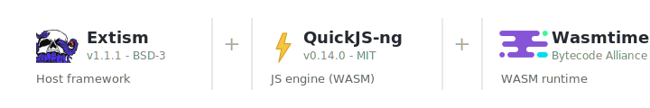

# openstaad-mcp v2: what changed and why

| | |
|---|---|
| **Author** | Dave Hanson, Application Security, Technology Services |
| **Covers** | openstaad-mcp 2.0.0 |
| **Updated** | 2026-04-28 |
| **Audience** | Internal stakeholders (supplemental to the public [README](../README.md)) |

AppSec audited openstaad-mcp in April 2026. We found five High-severity sandbox escapes that all share the same root cause: the v1 sandbox ran AI-generated Python via `exec()` with a live COM object in scope, and Python's object model gave user code a path to arbitrary code execution that no amount of AST filtering could close. Rather than patch them one at a time, we replaced the sandbox. User code now runs as JavaScript inside a WebAssembly isolate. Version bumped to 2.0.0.

Everything outside the sandbox -- the MCP server, COM bridge, transport, skills system, `.mcpb` distribution -- is unchanged.

---

## What this means for you

Agent-side code inside `execute_code` switches from Python to JavaScript. The COM API surface is identical. The translation is mechanical:

```python
# v1 (Python)
geo = staad.Geometry
n1 = geo.AddNode(0, 0, 0)
n2 = geo.AddNode(0, 120, 0)
b1 = geo.AddBeam(n1, n2)
print(f"Beam {b1}: node {n1} to {n2}")
```

```javascript
// v2 (JavaScript)
const geo = staad.Geometry;
const n1 = geo.AddNode(0, 0, 0);
const n2 = geo.AddNode(0, 120, 0);
const b1 = geo.AddBeam(n1, n2);
console.log(`Beam ${b1}: node ${n1} to ${n2}`);
```

Agents handle this without friction. All 15 bundled skill scripts and their documentation have been converted. COM method names, argument order, and call patterns are the same in both languages.

**What did not change:**

- MCP protocol surface (`discover_api`, `read_skills`, `list_instances`, `execute_code`, `get_status`)
- COM bridge (pywin32 + openstaadpy), `connect_and_run`, STA apartment threading
- `.mcpb` distribution (Claude Desktop drag-and-drop)
- `uvx` install path (VS Code + Copilot, GitHub Copilot CLI, Claude Code, Gemini CLI)
- Default HTTP URL: `http://127.0.0.1:18120/mcp`

---

## Why we rewrote the sandbox

The v1 `execute_code` tool ran AI-generated Python inside a hand-rolled sandbox: an AST walker, a restricted `__builtins__` dict, and `exec()`. The audit found five High-severity bypasses ([OMCP-001](../code-review/OMCP-001-sandbox-format-string-dunder-bypass.md), [003](../code-review/OMCP-003-sandbox-escape-com-internals.md), [004](../code-review/OMCP-004-executor-deadlock-after-timeout.md), [007](../code-review/OMCP-007-dos-unbounded-resource-consumption.md), [008](../code-review/OMCP-008-sandbox-mro-type-hierarchy-leak.md)).

These are not five independent bugs. They are five examples of the same structural problem. The raw COM dispatch object was injected straight into `exec()` globals, and Python's object model gives user code ways to climb from any live object reference to arbitrary code execution:

- `'{0.__class__.__init__.__globals__}'.format(obj)` -- `str.format()` traverses dunders and leaks module internals
- `obj._oleobj_.InvokeTypes(...)` -- reaches pywin32's raw IDispatch pointer through a Python attribute
- `type(obj).__mro__[1].__subclasses__()` -- walks the type hierarchy to find `os._wrap_close`, then reaches `builtins`

None of these touch the STAAD API. They never call `GetNodeCoordinates` or `AddBeam` or anything that looks like a COM method. They use Python's own runtime features -- dunder access, MRO traversal, descriptor protocol, format string mini-language -- to get from the COM object to `os`, `subprocess`, `builtins`. You could patch these five, but the next researcher would find five more. **The Python language itself is the attack surface** when user code shares a process with the host. The only fix is to stop giving user code access to Python's object model entirely.

---

## How the new sandbox works

The MCP server is still Python. The COM bridge is still Python (pywin32, STA threading). What changed is where user code runs.

In v1, user code was Python running inside the same process via `exec()`. The AST filter was the only barrier, and because the code shared the Python runtime with the host, it could reach anything Python can reach.

In v2, user code is JavaScript running inside a WebAssembly isolate. The WASM runtime ([Wasmtime](https://wasmtime.dev/)) gives the code its own linear memory, completely separate from the Python process. It cannot see host memory, cannot call host functions unless we explicitly export them, and has no filesystem, network, or module loader. The JS engine is [QuickJS-ng](https://github.com/quickjs-ng/quickjs) compiled to WASM (~200 KB), loaded in-process by [Extism](https://extism.org/) v1.1.1.

<div align="center">



</div>

### How user JS talks to STAAD

The sandbox exports exactly two host functions:

1. `com_get(handle, property)` -- reads a property or sub-object from the COM object
2. `com_invoke(handle, method, args)` -- calls a method on the COM object

When JS code does `staad.Geometry`, the sandbox calls `com_get` with the root handle and the string `"Geometry"`. The host-side Python code checks that against the allowlist ([`ALLOWED_SUB_OBJECTS`](../src/openstaad_mcp/sandbox/constants.py#L27-L38): 9 names), makes the real COM call, and returns a handle (an integer) back to JS. When JS then calls `geo.AddNode(0, 0, 0)`, the sandbox calls `com_invoke` with that handle, the method name, and the args. The host checks the method name against the allowlist, makes the COM call, and returns the result as JSON.

Everything crosses a JSON boundary. COM pointers and dispatch objects never enter the sandbox. The JS code only ever sees integers (handles) and JSON values. We enumerated all 727 methods across the root object and 9 sub-objects from a live STAAD.Pro instance ([`enumerate-com-api.py`](plan-research-support/enumerate-com-api.py)) and reviewed them by hand.

### Controls on the COM bridge

Every `com_invoke` call passes through six sequential gates before `fn(*args)` fires:

1. **Deadline check** -- 30 s wall-clock timeout per `execute_code` call
2. **JSON parse + type coercion** -- input validated before anything else
3. **Handle-table lookup** -- only root + 9 known sub-objects are reachable
4. **Global deny list** -- [`DENIED_METHODS`](../src/openstaad_mcp/sandbox/constants.py#L82-L90) blocks dangerous names outright
5. **Per-object positive allowlist** -- root: 26 methods ([`ALLOWED_ROOT_METHODS`](../src/openstaad_mcp/sandbox/constants.py)), sub-objects: deny-by-default, 727 methods across 9 objects ([`ALLOWED_SUB_OBJECT_METHODS`](../src/openstaad_mcp/sandbox/constants.py)). Anything not explicitly listed is rejected before `getattr` runs.
6. **Consent gate** -- filesystem-write and session-destructive methods (`SaveModel`, `NewSTAADFile`, `ExportView`, `Quit`, etc.) trigger MCP elicitation, a host-mediated confirmation dialog the user must approve. The LLM cannot self-confirm this gate.

Only after all six does `getattr(target, method)` fire, and only then does `fn(*args)` execute.

### Why the Python COM bridge is safe even though it is outside the sandbox

The host functions (`com_get`, `com_invoke` in [`wasm_executor.py`](../src/openstaad_mcp/sandbox/wasm_executor.py)) do run in Python and do call `getattr` on real COM dispatch objects. That sounds like the same problem we just described, but there is a critical difference: this is server code we wrote, not AI-generated code the LLM produced. User code never touches Python. It runs as JavaScript inside the WASM isolate and can only send JSON messages (a handle integer, a method name string, an args array) through the host-function boundary. The host function receives that method name, checks it against the allowlist, and only then calls `getattr(target, method)`. The user cannot pick which Python function runs, cannot pass Python objects as arguments, cannot manipulate the call stack, and cannot reach anything outside those three host functions. The `getattr` is safe because the method name already passed the allowlist -- it can only be one of the explicitly approved COM method names, not `__class__`, not `__mro__`, not `_oleobj_`. The attack surface that made v1 exploitable -- user code with direct access to Python's object model -- simply does not exist in this architecture.

### Per-call isolation and limits

Each `execute_code` call gets a fresh WASM plugin instance. No state leaks between executions -- globals, handles, and output buffers are scoped to a single call.

Resource limits (none of these existed in v1):

| Limit | Value |
|-------|-------|
| Wall-clock timeout | 30 s |
| WASM memory | 64 MiB |
| Max source code | 256 KiB |
| Max stdout/stderr | 256 KiB |
| COM worker threads | 20 (process-wide semaphore) |

See [`sandbox/constants.py`](../src/openstaad_mcp/sandbox/constants.py#L96-L108).

---

## What else shipped in 2.0.0

Beyond the sandbox rewrite, we fixed several other security issues and made improvements to the skill documentation and tooling.

### Security hardening

- **Mandatory HTTP bearer auth.** Server auto-generates a bearer token (`secrets.token_urlsafe(32)`) in memory at startup, pushes it to [OneTimeSecret](https://uk.onetimesecret.com) via the v2 guest API, and displays only the one-time share URL in the terminal startup banner. The token never appears in process arguments, logs, config files, or on the command line. If OTS is unreachable, the raw token is printed in the banner instead. No default, no dev flag, no escape hatch. ([OMCP-006](../code-review/OMCP-006-http-unauthenticated-default.md), [OMCP-012](../code-review/OMCP-012-token-in-process-args.md))
- **DNS rebinding defence.** [`HostHeaderMiddleware`](../src/openstaad_mcp/http_security.py) rejects requests with non-allowlisted `Host` headers (HTTP 421) before auth fires. Default: loopback only. Extend with `--allowed-host` for tunnels/proxies. ([OMCP-010](../code-review/OMCP-010-missing-sec-fetch-middleware.md))
- **Consent gate for destructive COM methods.** Filesystem-write and session-destructive methods are blocked by default. When `execute_code` detects such a method in submitted code, the server triggers MCP elicitation -- a host-mediated confirmation dialog presented directly to the human. ([OMCP-005](../code-review/OMCP-005-com-api-filesystem-write-ntlm-relay.md))
- **Path traversal hardened.** `read_skills` now uses `Path.resolve()` + `is_relative_to()` containment. Tests cover `../`, absolute, backslash, drive letter, and null byte vectors. ([OMCP-002](../code-review/OMCP-002-path-traversal-read-skills.md))
- **Error sanitisation.** COM exceptions are caught in host functions and replaced with generic messages. No Python tracebacks, file paths, or module names cross the WASM boundary. Full details logged at DEBUG.
- **Bounded COM threads.** Process-wide semaphore (`MAX_COM_THREADS=20`) caps concurrent or abandoned COM worker threads. At the limit, new calls fail fast with `RuntimeError` instead of leaking another thread.
- **Evaluator.js runtime hardening.** `Host.getFunctions()` neutered, `Host.__hostFunctions` emptied, `Host.invokeFunc` wrapped to reject negative memory offsets (CFFI OverflowError DoS prevention), `fetch` removed.

### New tools

- **`read_analysis_output`.** Reads the `.ANL` (analysis output) or `.LOG` (solver diagnostic) file for the currently open model. Path derived server-side from `GetSTAADFile()` -- no user-supplied path, eliminates path traversal by design. Output capped at 512 KiB. This is the only way to programmatically access concrete, timber, and aluminum design results, which have no COM API methods.

### Skill and documentation improvements

These came out of running Bentley's Tutorial 2 and Tutorial 3 end-to-end through the MCP server and fixing every friction point we found:

- **Unified `staad-design` skill.** Replaced the steel-only `staad-steel-design` with a material-agnostic skill covering steel, concrete, timber, and aluminum. Five asset files provide material-specific code tables and result-reading guidance.
- **Unit conversion guidance.** COM API methods operate in the base unit (inches for English) regardless of `SetInputUnits`. Added a warning section in `staad-core` with JS conversion helpers and a conversion table (KIP to kN, in to m, KSI to kN/m2).
- **Load-case caching pattern.** Agents must call `GetPrimaryLoadCaseNumbers()` before `AnalyzeEx` and reuse the cached array. `UpdateStructure()` (demoted to fallback) clears the COM state backing this call, causing empty arrays and agent panic loops. This pattern eliminated the post-analysis file-reopen cycle that was the largest source of consent-prompt spam.
- **`GetMemberEndForces` code example.** Added an explicit 4-argument call example because agents consistently dropped the 4th argument when copying from the method-signature table alone.
- **Plate method return arrays.** Documented return-array element mappings for all plate stress/force/moment methods. Deprecated the combined `GetAllPlateCenterStressesAndMoments` (unreliable via COM) in favour of the separate methods.
- **`AreResultsAvailable()` false-negative quirk.** Documented that it can return `false` even when results are queryable. Agents now verify readiness by attempting a direct result query instead.
- **File-open confirmation pattern.** Agents verify a successful file open via `GetSTAADFile()` rather than retrying `OpenSTAADFile`, which triggers a consent prompt on every call.
- **Repeat load documentation.** Expanded the one-line `AddRepeatLoad` reference into a full section explaining repeat vs combination load semantics with worked examples.
- **Analysis status 3 guidance.** Status 3 (warnings) usually still produces valid results. Added `AreResultsAvailable()` and `UpdateStructure()` recovery guidance.
- **Concrete/timber/aluminum results.** Points agents to `read_analysis_output` for non-steel design results.


### What was removed

The entire v1 Python sandbox: `sandbox/ast.py` (AST walker), `sandbox/executor.py` (Python `exec()` engine), `sandbox/module_proxy.py` (fake module shims), `sandbox/const.py` (old constants). All 15 Python skill scripts. The `staad-steel-design` skill directory. Old test suite replaced by 23 WASM executor tests + 41 adversarial tests + 9 evaluator hardening tests + 19 MCP integration tests.

---

## Security scorecard

| Finding | Severity | v1 | v2 |
|---------|----------|----|----|
| OMCP-001: `str.format()` dunder bypass | High | Exploitable | **Eliminated** |
| OMCP-002: Path traversal in `read_skills` | High | Exploitable | **Fixed** |
| OMCP-003: COM internal attributes bypass | High | Exploitable | **Eliminated** |
| OMCP-004: Executor deadlock after timeout | High | Exploitable | **Eliminated** |
| OMCP-005: COM filesystem write | Medium | Unmitigated | **Fixed** |
| OMCP-006: HTTP unauthenticated by default | High | Exploitable | **Fixed** |
| OMCP-007: Unbounded resource consumption | High | Exploitable | **Fixed** |
| OMCP-008: MRO type hierarchy leak | High | Exploitable | **Eliminated** |
| OMCP-009: Prompt injection via COM output | Medium | Unmitigated | **Accepted risk** |
| OMCP-010: Missing DNS-rebinding defence | Medium | Unmitigated | **Fixed** |
| OMCP-012: Token in process args | Info | Visible in `ps` | **Fixed** |

7 High-severity findings: 4 eliminated by the sandbox rewrite, 3 fixed. 3 Medium findings: 1 fixed, 2 accepted. 1 Info finding fixed.

---

## Verification

### Functional testing

We ran [Bentley's Tutorial 2 (RC Framed Structure)](https://docs.bentley.com/LiveContent/web/STAAD.Pro%20Help-v2024/en/topics/Getting_Started/Tutorial%20Problem%202/c-stpst_TUT02_RC_Framed_Structure.html) end-to-end through the MCP server using GitHub Copilot in VS Code. The full workflow -- geometry creation, prismatic section assignment, material constants, P-Delta analysis, and ACI 318-14 concrete design -- was driven entirely via `execute_code` calls through the WASM sandbox. All 5 members passed concrete design (columns at 0.634 and 0.812 utilization, beams and one column at 1.000 governed by torsion). Results match Bentley's documentation. Evidence preserved in [`plan-research-support/tutorial2-rc-frame/`](plan-research-support/tutorial2-rc-frame/).

We also ran [Tutorial 3 (Analysis of a Slab)](https://docs.bentley.com/LiveContent/web/STAAD.Pro%20Help-v2024/en/topics/Getting_Started/Tutorial%20Problem%203/c-stpst_TUT03_Analysis_of_a_Slab.html) -- plate elements, area loads, and plate stress/force output -- with all results matching Bentley documentation to 4+ significant figures. A friction analysis of the Tutorial 3 run identified five agent pain points; all five were fixed in skill documentation. A rerun confirmed `execute_code` calls dropped from 18 to 7 and consent prompts from 5 to 2.

### Adversarial testing

41 owner-authored red-team tests covering prompt injection, sandbox escape, and OOB exfiltration. Full attack chain: payloads planted in live `.std` via COM, saved to disk, read back through the sandbox. 7 OOB exfil vectors tested with Burp Collaborator -- zero DNS hits (fetch, XHR, WebSocket, import, Request, eval+fetch all blocked). 9 evaluator hardening tests confirm runtime globals are neutered. 19 MCP integration tests spawn the real server via stdio and verify hardening, allowlists, consent gates, and protocol edge cases.

### Test suite

```powershell
# From the repo root with a venv set up:
pytest tests -q
# Expected: 308 passed, 6 skipped, 2 xfailed (non-STAAD machine)
# 316 total tests collected
#
# The 6 skips are MCP protocol smoke tests that require a running
# server instance. Not sandbox-related.

# With STAAD.Pro running and a model open:
pytest tests/test_integration.py -v -m integration
# Expected: 10 passed (read, write, math round-trip, perf bounds)

# Adversarial tests (requires live STAAD.Pro):
pytest tests/adversarial/ -v -s
# Expected: 41 passed
```

Performance: plugin spin-up plus 100 sequential host calls completes in ~110 ms. A trivial `execute_code` call takes ~57 ms end to end.

---

## Where things stand

Implementation is complete. All 316 tests pass. Live-STAAD round-trip verified for read, write, math, and console capture against a real STAAD.Pro 2026 instance.

### Before the 2.0.0 tag

Tracked in [`docs/plan.md`](plan.md) under Phase 6.

**Release-blocking:**

- [x] Owner-authored adversarial test pass (2026-04-23). See Phase 6 in plan.md for full results.
- [ ] Clean-Windows `.mcpb` install smoke test. PyInstaller artifact on a machine without Python, end-to-end agent round-trip in Claude Desktop.
- [x] Changelog and release notes. See `CHANGELOG.md`.

**Nice-to-have (not gating):**

- [ ] `uvx` install flow smoke test from a clean machine.
- [ ] README `execute_code` example refresh and security-model note.
- [ ] Production performance re-measurement.
- [ ] Stress test (large output, rapid sequential `execute_code` calls).

The sandbox work is done and tested. What remains is packaging and a clean-install smoke test.

---

## Audit findings: full disposition

Full writeups live in [`code-review/`](../code-review/). The index is [`openstaad-mcp-security-audit-Apr-14-2026-0000.md`](../code-review/openstaad-mcp-security-audit-Apr-14-2026-0000.md).

### Sandbox escapes (the reason for the rewrite)

| ID | Summary | Status in v2 |
|----|---------|--------------|
| [OMCP-001](../code-review/OMCP-001-sandbox-format-string-dunder-bypass.md) | `str.format()` reached arbitrary dunders, path to builtins. | Gone. JavaScript has no dunders. |
| [OMCP-003](../code-review/OMCP-003-sandbox-escape-com-internals.md) | Raw COM object in `exec()` globals exposed `_oleobj_`, `_dispobj_`, etc. | Gone. COM objects never enter the WASM address space. |
| [OMCP-004](../code-review/OMCP-004-executor-deadlock-after-timeout.md) | Threading lock held after timeout, deadlocking subsequent calls. | Gone. No threading lock; timeout is a deadline check. |
| [OMCP-007](../code-review/OMCP-007-dos-unbounded-resource-consumption.md) | No memory, CPU, or output caps. | Fixed. 64 MiB / 30 s / 256 KiB caps enforced by WASM runtime. |
| [OMCP-008](../code-review/OMCP-008-sandbox-mro-type-hierarchy-leak.md) | `type.__mro__` traversal reached protected types. | Gone. No MRO in JavaScript. |

All five exploited the same root cause. Moving user code to a WASM isolate removes the attack surface entirely.

### Other findings fixed

| ID | Summary | Status in v2 |
|----|---------|--------------|
| [OMCP-002](../code-review/OMCP-002-path-traversal-read-skills.md) | `read_skills` path traversal. | Fixed. [`_read_skill`](../src/openstaad_mcp/skills.py#L77) uses `Path.resolve()` + [`is_relative_to()`](../src/openstaad_mcp/skills.py#L103). Tests: [`test_skills_security.py`](../tests/sandbox/test_skills_security.py). |
| [OMCP-005](../code-review/OMCP-005-com-api-filesystem-write-ntlm-relay.md) | COM file-write + NTLM relay via UNC paths. | Filesystem write: **Fixed** via consent gate (MCP elicitation blocks destructive methods by default). NTLM relay via UNC paths: **Accepted risk** -- see below. Deny list blocks `SetStandardProfileDBFolder`. See [`constants.py`](../src/openstaad_mcp/sandbox/constants.py). |
| [OMCP-006](../code-review/OMCP-006-http-unauthenticated-default.md) | HTTP unauthenticated by default. | Fixed. Bearer token auto-generated and delivered via OTS share URL in the terminal banner. |
| [OMCP-010](../code-review/OMCP-010-missing-sec-fetch-middleware.md) | No DNS-rebinding defence beyond loopback bind. | Fixed. [`HostHeaderMiddleware`](../src/openstaad_mcp/http_security.py) rejects disallowed Host headers with 421. 32 tests in [`test_http_security.py`](../tests/test_http_security.py). |
| [OMCP-011](../code-review/OMCP-011-info-disclosure-stack-traces.md) | Stack traces leaked across tool boundary. | Improved. Host functions sanitise errors before returning to sandbox. |
| [OMCP-012](../code-review/OMCP-012-token-in-process-args.md) | Token visible in process args. | Fixed. `--token` removed. Bearer token auto-generated in memory; one-time share URL displayed in terminal banner. Never appears on CLI or disk. |

### Accepted risks

| ID | Summary | Why accepted |
|----|---------|--------------|
| [OMCP-009](../code-review/OMCP-009-indirect-prompt-injection-com-output.md) | Indirect prompt injection via COM return values. | Still a real risk, now validated by adversarial testing. Structural engineers routinely receive `.std` files from third parties, and a crafted file can embed prompt-injection payloads in member names, load-case names, or comments. When the agent queries that data via `execute_code`, the payload lands in the agent's context unsanitized. 19 PI payloads confirmed flowing through live COM round-trip. Sandbox containment confirmed: 7 OOB exfil vectors tested with Burp Collaborator, zero DNS hits. The blast radius through our server is minimal -- the WASM sandbox has no filesystem, network, or process access, and our MCP tools are all read-only or sandbox-confined. But the agent likely has other tools registered (filesystem, git, web search), and a successful injection via our output could manipulate the agent into misusing those. We own that risk even though the damage happens elsewhere. We accept it because reliable prompt-injection detection in arbitrary structural-engineering data is an unsolved problem, and stripping content would break legitimate workflows. The practical mitigation is agent-side: system prompts and tool-use policies that treat MCP tool output as untrusted. Residual risk: medium. |
| [OMCP-005](../code-review/OMCP-005-com-api-filesystem-write-ntlm-relay.md) | NTLM relay via UNC paths in COM arguments. | The WASM sandbox does not filter UNC paths (`\\host\share`) from COM string arguments. If an attacker-controlled UNC path reaches a COM method that opens it, Windows will send an NTLM authentication handshake to the remote host. We accept this because: (1) the consent gate already requires human approval for every file-write method, so the user sees the path before it fires; (2) NTLM relay is a network-level attack that should be mitigated by the deployment environment (SMB signing, NTLM disabled, outbound 445 blocked); and (3) a robust UNC filter is harder than it looks -- forward-slash UNC, extended-length paths, and null-byte prefixes all bypass naive checks. Residual risk: low-medium, contingent on corporate network hardening. |
| [OMCP-010](../code-review/OMCP-010-missing-sec-fetch-middleware.md) | Sec-Fetch-Site not implemented. | Deliberate. DNS rebinding is blocked by HostHeaderMiddleware. Sec-Fetch-Site would be a fourth check on top of loopback bind, bearer auth, and Host-header gate. |

---

## Further reading

- [`README.md`](../README.md) -- public overview, install instructions, security model summary
- [`docs/plan.md`](plan.md) -- full design and implementation plan, COM API security surface analysis
- [`code-review/`](../code-review/) -- the April 2026 audit findings
- [`sandbox/wasm_executor.py`](../src/openstaad_mcp/sandbox/wasm_executor.py) -- sandbox implementation
- [`sandbox/constants.py`](../src/openstaad_mcp/sandbox/constants.py) -- allowlists and resource limits

--Dave
